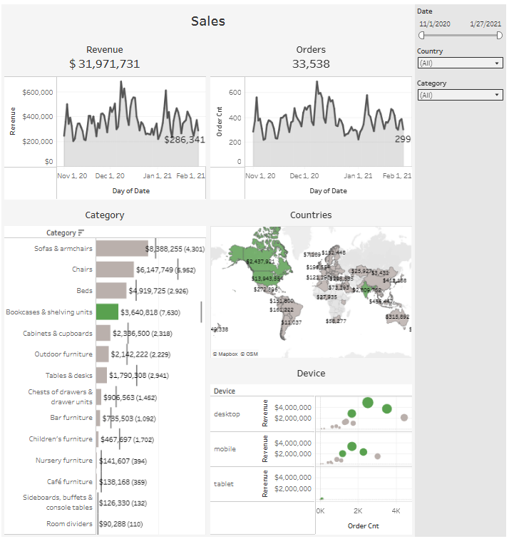

# E-Commerce Sales Dashboard (Tableau)

This repository showcases an interactive dashboard built in Tableau Public. It analyzes sales performance for an e-commerce platform, focusing on key metrics like Revenue and Orders.

---

##  Live Interactive Dashboard

### [➡️ Click here to view the interactive dashboard on Tableau Public]([https://public.tableau.com/views/Sales_17533800046310/Sales?:language=en-US&publish=yes&:sid=&:redirect=auth&:display_count=n&:origin=viz_share_link])

---

##  Dashboard Preview

##  Dashboard Overview

This dashboard provides a comprehensive overview of sales performance, allowing users to analyze trends and segments. The data covers the period from November 1, 2020, to January 27, 2021.

### Key Metrics
* **Total Revenue:** $31.6M
* **Total Orders:** 33.5K

### Visualizations
The dashboard includes several key components:

1.  **Time-Series Analysis:** Line charts showing daily `Revenue` and `Orders` trends over time.
2.  **Top Categories:** A horizontal bar chart displaying `Revenue` and `Order Cnt` by product `Category`, highlighting top performers.
3.  **Geographical Sales:** A world map (`Countries`) visualizing revenue distribution across different geographical markets.
4.  **Device Performance (Summary):** Bar charts showing `Revenue` and `Order Cnt` distribution by `Device` type (desktop, mobile, tablet).
5.  **Device Performance (Detail):** A scatter plot analyzing `Revenue` vs. `Order Cnt` for each `Device` type, providing insights into sales efficiency per device.

### Interactive Filters
* **Date Range:** Allows filtering for a specific time period.
* **Country:** Allows drilling down into a specific country's performance.
* **Category:** Allows filtering for one or more product categories.
